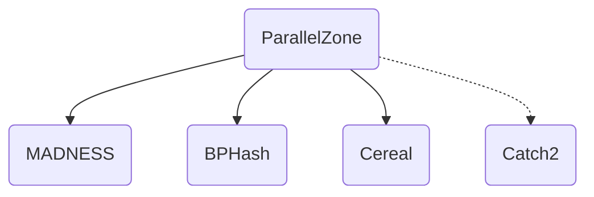

# ParallelZone

Parallel runtime for NWChemEx. Still in the early stages of development. 
See [discussions](https://github.com/NWChemEx-Project/ParallelZone/discussions) for further information.

## Dependencies
ParallelZone depends on 
- [MADNESS](https://github.com/m-a-d-n-e-s-s/madness) for parallel runtime, 
- [BPHash](http://bennybp.github.io/) for hashing, and 
- [Cereal](https://uscilab.github.io/cereal/) for serialization. 
- [Catch 2](https://github.com/catchorg/Catch2) is required only for testing. 

See documentation for more details.

