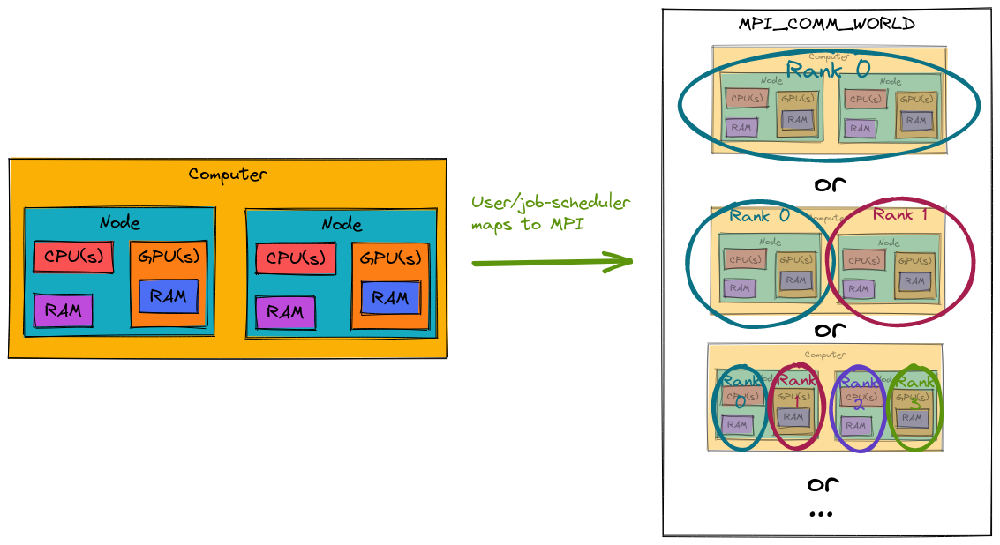

.. Copyright 2022 NWChemEx-Project
..
.. Licensed under the Apache License, Version 2.0 (the "License");
.. you may not use this file except in compliance with the License.
.. You may obtain a copy of the License at
..
.. http://www.apache.org/licenses/LICENSE-2.0
..
.. Unless required by applicable law or agreed to in writing, software
.. distributed under the License is distributed on an "AS IS" BASIS,
.. WITHOUT WARRANTIES OR CONDITIONS OF ANY KIND, either express or implied.
.. See the License for the specific language governing permissions and
.. limitations under the License.

##########################
The ParallelZone Worldview
##########################

To use ParallelZone it is helpful to understand the abstraction model at a high
level. In our opinion this is most easily done by contrasting the ParallelZone
model with the :ref:`MPI` model.

*****************
The MPI Worldview
*****************

:ref:`mpi_runtime` illustrates a simplified version of the MPI worldview. The
MPI worldview is process-centric. In the MPI worldview, ``MPI_COMM_WORLD`` is
the name given to the set of all processes. Within our example
``MPI_COMM_WORLD`` has three processes. MPI assigns these processes an
integer value (ranging from 0 to "the number of processes minus 1") called the
process's rank. It's then up to the developer to use the ranks to split the work
up. For example the developer could opt to have:

- rank 0 run ``foo`, rank 1 run ``bar``, and rank 2 run ``baz``, or
- rank 0 run ``foo`` on the first batch of data, rank 1 run ``foo`` on the
  second batch, and rank 2 runs ``foo`` on the third batch.

(``foo``, ``bar``, and ``baz`` being the names of some largely arbitrary opaque
functions).

.. _mpi_runtime:

.. figure:: assets/mpi.png
   :align: center

   MPI runtime

Unfortunately on today's machines it takes more than distributing tasks or
data to otherwise opaque processes to achieve high-performance. This is because
today's machines are substantially more heterogeneous than the machines MPI was
designed for.

.. _hardware2mpi:

   MPI on a modern computer

Consider the scenarios depicted in :ref:`hardware2mpi`. Since MPI ranks are
logical entities and not physical there is many ways we can map the physical
hardware to MPI ranks. For example, we could make the entire computer one
big MPI rank, or we could make each node an MPI rank, or we could put each
CPU and GPU in its own MPI rank, or we could... The point is that if we just
throw tasks/data at MPI ranks we're going to get very different performance
depending on what the hardware underlying those ranks is.

********************
Back to ParallelZone
********************

When a multi-process program starts running there is some total set of
resources (here a "resource" is a somewhat catchall term that includes CPU,
GPU, memory, etc.) available to that program. However, typically each process
only has direct access to a subset of those resources. ParallelZone defines
the set of resources local to a process as a "resource set". Users of
ParallelZone write their code in terms of the resources in the process's
resource set and not in terms of arbitrary ranks.

As a somewhat technical aside, the assignment of resources to resource sets
uses the same mechanism as assigning resources to the initial MPI ranks
(typically a job scheduler). Thus resource sets are to some extent a
re-branding of MPI ranks. The main difference between ParallelZone and MPI is
that MPI requires the user to manually map MPI ranks back to resources. Resource
sets in ParallelZone encapsulate the rank-to-resource mapping so that users can
jump straight from resource sets to resources. Admittedly, this difference seems
minor, but as will be seen this leads to dramatically simpler code.
