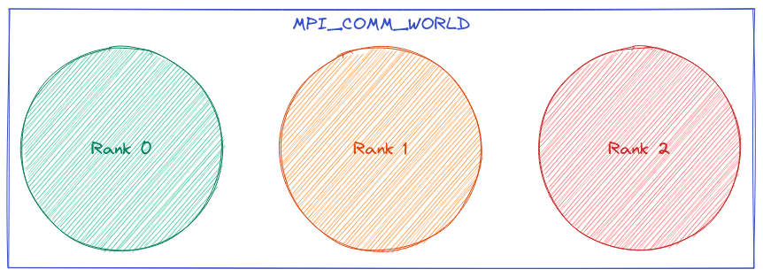
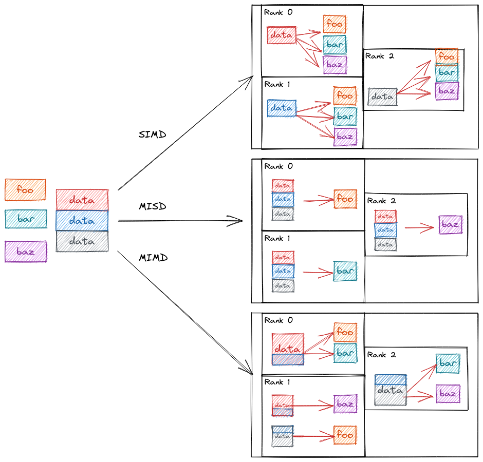

.. Copyright 2022 NWChemEx-Project
..
.. Licensed under the Apache License, Version 2.0 (the "License");
.. you may not use this file except in compliance with the License.
.. You may obtain a copy of the License at
..
.. http://www.apache.org/licenses/LICENSE-2.0
..
.. Unless required by applicable law or agreed to in writing, software
.. distributed under the License is distributed on an "AS IS" BASIS,
.. WITHOUT WARRANTIES OR CONDITIONS OF ANY KIND, either express or implied.
.. See the License for the specific language governing permissions and
.. limitations under the License.

##########################
The ParallelZone Worldview
##########################

.. note::

   TL;DR. In ParallelZone the ``RuntimeView`` instance is your handle to the
   runtime environment. ``RuntimeView`` is a container of ``ResourceSet``
   objects. ``ResourceSet`` objects describe the resources (*i.e.*, RAM, CPUs,
   GPUs, *etc.*) that processes have direct/local access to.

To use ParallelZone it is helpful to understand the abstraction model at a high
level. ParallelZone expands on the :ref:`MPI` model. So we start with a brief
review of MPI.

**********
MPI Primer
**********

:numref:`fig_mpi_runtime` illustrates a simplified version of how MPI sees a
program. The view is process-centric. When the program starts, MPI defines a
set ``MPI_COMM_WORLD`` which includes all of program's processes. Within our
example ``MPI_COMM_WORLD`` has three processes. MPI assigns these processes an
integer value (ranging from 0 to "the number of processes minus 1") called the
process's rank. More complicated MPI setups can have further partition
``MPI_COMM_WORLD`` into subsets, but the overall point remains: MPI's view of
a program is a series of processes somehow grouped together.

.. _fig_mpi_runtime:

   Illustration of MPI's runtime abstraction model.

In a typical MPI-based program parallelism is expressed by somehow mapping tasks
and data to ranks. For example say we have three arbitrary functions ``foo``,
``bar``, and ``baz` and a chunk of data we want to run ``foo``, ``bar``, and
``baz`` on. :numref:`fig_mpi_mappings` shows the three ways we can do this in
parallel.

.. _fig_mpi_mappings:

   Possible ways of mapping data and tasks to MPI ranks.

In the :ref:`simd` approach depicted at the top of :numref:`fig_mpi_mappings` we
distribute the data over the MPI ranks and have each rank pass its local chunk
of data to the three functions. In :ref:`misd`, which is shown in the middle of
:numref:`fig_mpi_mappings` we instead distribute the functions over the ranks.
Finally, in the :ref:`mimd` model shown at the bottom of
:numref:`fig_mpi_mappings` we distribute both the data and the functions.

Unfortunately on today's machines it takes more than distributing tasks and/or
data to otherwise opaque ranks to achieve high-performance. This is because
the performance also depends on the hardware available to each rank and how
well utilized that hardware is.

*********************
Focusing on Resources
*********************

In ParallelZone we go beyond MPI by mapping tasks/data to hardware, bypassing
the rank concept to the extent possible. More specifically, in ParallelZone we
start by assuming that when a multi-process program starts running there is
some total set of resources (here a "resource" is a somewhat catchall
term that includes CPU, GPU, memory, etc.) available to that program. This
total set of resources may or may not be all of the resources on the computer
and it also may or may not be the case that ParallelZone can access all of the
program's resources. Regardless, the set of resources ParallelZone can access
forms the ``RuntimeView``.

.. _fig_nesting_runtime_views:

.. figure:: assets/nesting_runtime_views.png
   :align: center

   Here the blue oval depicts the total resources the program is allowed to use
   and the green oval shows the resources the program lets ParallelZone use. In
   the top scenario ParallelZone manages all of the program's resources, whereas
   in the bottom scenario it manages only some of the program's resources.

To better illustrate the relationship between the program's total resources
and the ``RuntimeView``, :numref:`fig_nesting_runtime_views` shows two possible
ways a ``RuntimeView`` may initialized. The top scenario shown in
:numref:`fig_nesting_runtime_views` occurs when the entire program uses
ParallelZone as its parallel runtime. In this scenario a job is spun up with
some set of resources and ParallelZone is allowed to manage all of them
(*N.B.*, while both scenarios in :numref:`fig_nesting_runtime_views`
show ParallelZone only managing one node ParallelZone can manage multiple
nodes). Another common scenario occurs when a program relying on ParallelZone is
being driven by another program. In this scenario, the program has access to
more resources than it shares with ParallelZone.

Programs built on ParallelZone treat ``RuntimeView`` as the full set of
resources regardless of whether it is or isn't.

*****************
Resource Affinity
*****************

Simply knowing the total amounts of resources available isn't quite enough. We
also need to know which resources the current process has an affinity for. In
ParallelZone we keep this simple by partitioning each process's resources into
two sets: those it has an affinity for and those it doesn't. The set of
resources a process has an affinity for is termed that process's
``ResourceSet``. The ``ResourceSet`` of a process is populated with the
resources in the ``RuntimeView`` which are located physically on the node where
the process is running.

.. _fig_resource_set_mapping:

.. figure:: assets/resourceset_mapping.png
   :align: center

   ParallelZone's view of the runtime environment for the common scenario of
   one process per node.

:numref:`fig_resource_set_mapping` illustrates how ParallelZone sees the
hardware in the runtime environment when the program has one process running on
each node. In this scenario ``RuntimeView`` is managing the entire runtime
environment, meaning the ``RuntimeView`` object can see both nodes. The
``RuntimeView`` is then split in to two ``ResourceSet`` instances, each instance
seeing the node the current process is running on. In this scenario the
``ResourceSet`` objects are disjoint, *i.e.*, they do not share resources.

ParallelZone does not restrict users to running one process per node. If a
user runs more processes per node, then ParallelZone will give each of those
processes its own ``ResourceSet``; however, the ``ResourceSet`` objects will no
longer be disjoint since each process on a node can see the same resources.

**********
The Vision
**********

At the moment ParallelZone's feature set is pretty bare bones. The medium term
goal is for the ``ResourceSet`` objects to have task schedulers. Users will
estimate the resources needed for a task and tell a particular ``ResourceSet``
to run the task. The schedulers will automatically figure out how to best run
the task based on runtime conditions. Longer term we want to take this a step
further and add task schedulers to ``RuntimeView``. The task schedulers on
``RuntimeView`` would accept task graphs and take care of assigning the tasks
in the graph to the schedulers in the individual ``ResourceSet`` objects.
