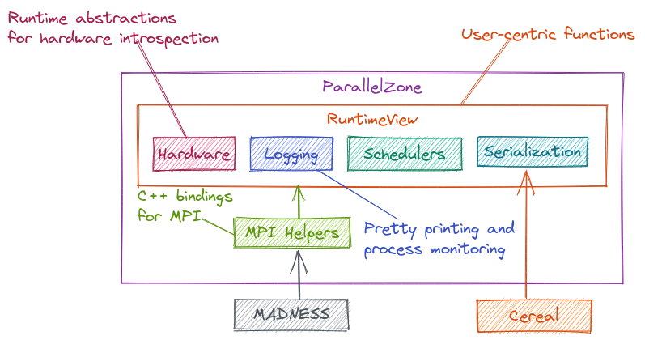

.. Copyright 2022 NWChemEx-Project
..
.. Licensed under the Apache License, Version 2.0 (the "License");
.. you may not use this file except in compliance with the License.
.. You may obtain a copy of the License at
..
.. http://www.apache.org/licenses/LICENSE-2.0
..
.. Unless required by applicable law or agreed to in writing, software
.. distributed under the License is distributed on an "AS IS" BASIS,
.. WITHOUT WARRANTIES OR CONDITIONS OF ANY KIND, either express or implied.
.. See the License for the specific language governing permissions and
.. limitations under the License.

.. _parallel_zone_architecture:

#########################
ParallelZone Architecture
#########################

:ref:`parallel_zone_design` describes the top-level design decisions which went
into establishing ParallelZone's scope. Here we lay out the architecture of
ParallelZone. The overall architecture is shown in
Figure: :numref:`architecture`.

.. _architecture:

   Software architecture of ParallelZone.

The outer box labeled "ParallelZone" delimits the contents of the ParallelZone
library from its dependencies. The box labeled "RuntimeView" delimits the
user-centric :ref:`api` from the implementation details.

.. note::

   At the moment ParallelZone has no schedulers. The "Schedulers" box is thus
   presently a placeholder.

Notable design points:

- Exposure of a task-based parallel runtime via "Schedulers" component.
- :ref:`mpi` under the hood ensures backwards compatibility.
- Hardware introspection via "Hardware" component.

The following sections describe the ParallelZone components in more detail. The
sections are ordered such that they work their way up the software stack.

************
Dependencies
************

ParallelZone presently has one dependency: Cereal.

Cereal
======

See :ref:`serialization_design` for decisions underpinning the usage of Cereal.
Long story short, we need serialization and Cereal is a lightweight library
implementing it.

***********
MPI Helpers
***********

Main discussion :ref:`compp_design`.

The MPI standard exposes C APIs. "Proper" C++ MPI bindings should automate
much of the call to the C API. More specifically, by using template
meta-programming it is possible to perform type introspection and automatically
determine things like: what the object's type is, and how many are being
sent/received. The MPI Helpers component implements "proper" C++ MPI bindings,
which are then used by the rest of ParallelZone.

********
Hardware
********

.. todo::

   Document design and link to it.

*******
Logging
*******

Main page: :ref:`logging_design`.

The logging component is used for recording events that occur while
ParallelZone (and software built on ParallelZone) run. Events include:
important results, timing information, or problems.

**********
Schedulers
**********

.. todo::

   Write this section when more design has gone into the Schedulers.

*************
Serialization
*************

.. todo::

   Design the user-facing serialization API.

The Serialization component is primarily meant to support the "RuntimeView"
component, but given its utility to downstream repositories, the serialization
component is formally exposed as part of the user-centric API.

***********
RuntimeView
***********

Main page: :ref:`parallel_runtime_design`.

The "RuntimeView" component is the top-level API of ParallelZone. The name
"RuntimeView" is chosen to illustrate that it doesn't own the resources in the
runtime environment, but simply aliases them (the resources in the runtime
environment are mostly owned by the operating system).
