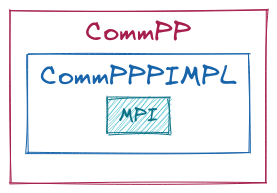
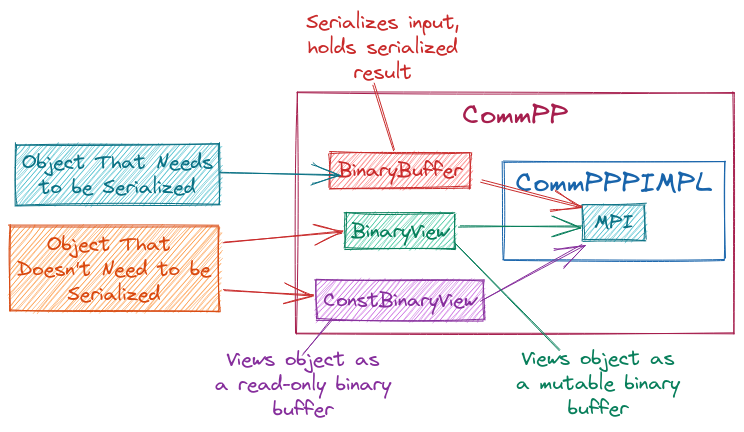

.. Copyright 2022 NWChemEx-Project
..
.. Licensed under the Apache License, Version 2.0 (the "License");
.. you may not use this file except in compliance with the License.
.. You may obtain a copy of the License at
..
.. http://www.apache.org/licenses/LICENSE-2.0
..
.. Unless required by applicable law or agreed to in writing, software
.. distributed under the License is distributed on an "AS IS" BASIS,
.. WITHOUT WARRANTIES OR CONDITIONS OF ANY KIND, either express or implied.
.. See the License for the specific language governing permissions and
.. limitations under the License.

.. _compp_design:

#####################
Designing ComPP Class
#####################

The design specifications in :ref:`runtime_view_design` and :ref:`ram_design`
call for a ``CommPP`` class to take care of the MPI operations. Here we
discuss the design of the ``CommPP`` class.

**********************
Why Do We Need CommPP?
**********************

ParallelZone needs access to MPI. MADNESS exposes MPI, but not in an
object-oriented way (AFAIK it just assumes you're working with types like
``double``, ``int``, etc.). ParallelZone is object-oriented and needs something
to bridge the gap between objects and types recognized by MPI. At a high-level
this leads to serialization, but naive application of serializaiton in an MPI
context can lead to inefficiencies. CommPP should automate the conversion from
objects to MPI data types in the most efficient manner possible.

*********************
Design Considerations
*********************

The list below includes considerations from :ref:`runtime_view_design` and
from :ref:`ram_design`.

1. Support for all-to-all, all-to-one, and one-to-all MPI operations
#. Provide parallel primitives for building up more sophisticated infrastructure
#. SIMD API
#. Heavy use of template meta-programming to simplify API
#. Generic objects will need to be serialized.

*******************
CommPP Architecture
*******************

.. _fig_compp:

   Overall architecture of the CommPP class.

Conceptually the state of the CommPP class is simple. The only point of note
is that we use the PIMPL idiom to hide the MPI-based implementation from the
API. The tricky part of the ``CommPP`` class will be the conversion of objects
into a format suitable for consumption by MPI. Presently we adopt the lowest
common denominator, and transform all objects to binary.

.. _fig_obj2binary:

   Schematic illustration of how CommPP converts an object into a binary
   format.

:numref:`fig_obj2binary` sketches out the object-to-binary process. On the left
we see two input scenarios depending on whether the object the user provided
needs serialized or not. If the object needs serialized ``CommPP`` uses the
object to initialize a ``BinaryBuffer`` object. If the object does not need
serialized ``CommPP`` initializes a ``BinaryView`` or a ``ConstBinaryView``
instance depending on whether we need to mutate the object or not respectively.
``CommPP`` then uses the ``BinaryBuffer``, ``BinaryView``, or
``ConstBinaryView`` object to interact with MPI.

This design addresses the above concerns by:

1. Exposing the stated MPI operations in an object-oriented manner.
#. Not explicitly shown in the above architecture diagrams, but the APIs of
   the ``CommPP`` class are envisioned as having a number of overloads for a
   variety of scenarios. Choosing the optimal overload is a somewhat technical
   detail, which is why ``CommPP`` is thought of as an implementation detail.
#. Proposed APIs are covered in :ref:`runtime_view_design` and :ref:`ram_design`
#. Not explicitly shown, but it is expected that ``CommPP`` will use template-
   meta programming to deduce whether to convert an object into a
   ``BinaryBuffer``, ``BinaryView``, or ``ConstBinaryView``.
#. Serialization happens under the hood and is the responsibility of the
   ``BinaryBuffer`` class.
