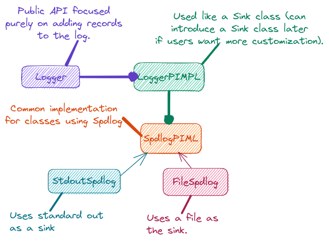

.. Copyright 2022 NWChemEx-Project
..
.. Licensed under the Apache License, Version 2.0 (the "License");
.. you may not use this file except in compliance with the License.
.. You may obtain a copy of the License at
..
.. http://www.apache.org/licenses/LICENSE-2.0
..
.. Unless required by applicable law or agreed to in writing, software
.. distributed under the License is distributed on an "AS IS" BASIS,
.. WITHOUT WARRANTIES OR CONDITIONS OF ANY KIND, either express or implied.
.. See the License for the specific language governing permissions and
.. limitations under the License.

.. _logger_design:

##########################
Designing the Logger Class
##########################

The discussion :ref:`logging_design` ends in concluding that ParallelZone needs
a ``Logger`` class. This page details the design and architecture of the
``Logger`` class and the underlying infrastructure needed to make it work.

*************************
What is the Logger Class?
*************************

The ``Logger`` class is the user-facing API of ParallelZone's logging
component.

********************************
Why do we need the Logger Class?
********************************

As summarized in :ref:`logging_design`, we are not aware of any existing logging
solutions that do everything we need. We have thus chosen to implement the
missing features, to our liking, within the ``Logger`` class. The 
``Logger`` class also provides a stable API for ParallelZone users should we
need to add additional logging capabilities or switch backends.

*********************
Logger Considerations
*********************

The considerations for the ``Logger`` class are the considerations from
:ref:`logging_design` not addressed there. Specifically:

1. Multiple logging levels.

   - Printing every message should be reserved for difficult debugging.
   - Severity level (info, warn, etc.) used to triage what to print.

#. Concurrency aware.

   - Thread-safe ideally.

#. Different "sinks"

   - Console, file, databases.

#. Enable/disable logging

   - Can be expensive, too verbose, etc.
   - Assume logging disabled for performance runs
   - Ideally logger configurable at compile and runtime.

*************************
Existing Logger Solutions
*************************

:ref:`existing_logging_solutions` covered the existing logging solutions in
detail and will not be replicated here. Instead we point out that of the 
available choices, Spdlog has most of the features we want and is heavily 
supported. As seen in the next section we have opted to build our ``Logger``
infrastructure around Spdlog.

*************
Logger Design
*************

.. _logger_arch:

   Architecture of the Logger class and its infrastructure.

For the first implementation of the logging component we adopted the simple
architecture shown in Figure :numref:`logger_arch`. Users of ParallelZone see
one class, ``Logger``. As a first pass, ``Logger`` simply provides APIs 
for printing arbitrary data at a specified severity level. Eventually, this may 
be expanded to support more fine-grained control over the log formatting.
Internally ``Logger`` is implemented by a ``LoggerPIMPL`` object. In this 
first pass the ``LoggerPIMPL`` is simply a wrapper around Spdlog and controlling 
the sink for the ``Logger`` class amounts to configuring the Spdlog object 
in the PIMPL. Ultimately we chose to use Spdlog because it is relatively 
lightweight, has enough features for our current needs, and is well supported.

LoggerPIMPL Design
==================

At the moment, the ``LoggerPIMPL`` class is primarily meant to isolate the
``Logger`` class from the details of its sink. While sinks are usually
singletons, we leave that as an implementation detail for the class implementing
``LoggerPIMPL``.

This design addresses the considerations remaining from  
:ref:`logging_design` by:

1. Multiple logging levels.

   - Gained by using Spdlog.

#. Concurrency aware.

   - Spdlog is thread-safe.

#. Different "sinks"

   - Provided by Spdlog.

#. Enable/disable logging

   - Spdlog supports log filtering by severity.
   - Logger can have a null pointer to represent null logging.

*********************
Future Considerations
*********************

The current design gets the job done, while being amenable to extension. In
particular we note:

- Can add ``Sink`` classes so users define their own sink behavior (Spdlog
  also allows custom sinks, so our ``Sink`` class would wrap theirs).