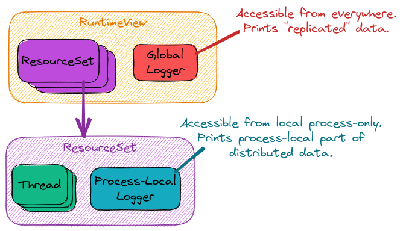

.. Copyright 2022 NWChemEx-Project
..
.. Licensed under the Apache License, Version 2.0 (the "License");
.. you may not use this file except in compliance with the License.
.. You may obtain a copy of the License at
..
.. http://www.apache.org/licenses/LICENSE-2.0
..
.. Unless required by applicable law or agreed to in writing, software
.. distributed under the License is distributed on an "AS IS" BASIS,
.. WITHOUT WARRANTIES OR CONDITIONS OF ANY KIND, either express or implied.
.. See the License for the specific language governing permissions and
.. limitations under the License.

.. _logging_design:

###############################
Designing the Logging Component
###############################

*****************
What is a Logger?
*****************

A logger is a software element (in our case a class) which records events.
Events can be be almost anything including: user interactions, errors, timing
information, progress reports, and status. Typically the events are recorded
to a console, file, or database. Logging is particularly important for
understanding complicated software systems including those with concurrency,
automation, and remote access.

Logging is not meant for data archival. While you may want to output important
results in the logs, keep in mind that logs are often turned off/overridden,
etc. So while it's okay to put results in the logs, they need to go to a more
permanent location as well.

***********************************
Why Do We Need a Logging Component?
***********************************

The ParallelZone runtime is designed to make writing high-performance software
as easy as possible. Most high-performance software is very complicated
(even if much of the complication is abstracted away). Complications include:

- Concurrency. The program is actually doing multiple things at once.
- Non-deterministic ordering. Tasks do not necessarily run in the same order
  each time.
- Job scheduling. Job is typically run remotely and in a manner that makes it
  hard to access the program.

It thus becomes imperative for the software to log events so that developers
(and users) can figure out what happened after a run completes, particularly if
the run is unsuccessful.

**********************
Logging Considerations
**********************

1. Multiple loggers.

   - Want loggers with different scopes (global, process-local, thread-local).
   - Useful for turning on/off logging in different parts of the code.
   - Logger backend/configuration determines if each logger has different output

#. Multiple logging levels.

   - Printing every message should be reserved for difficult debugging.
   - Severity level (info, warn, etc.) used to triage what to print.

#. Concurrency aware.

   - Thread-safe ideally.
   - Distributed logging is "relatively easy" to add after the fact.

#. Different "sinks"

   - Console, file, databases.

#. Enable/disable logging

   - Can be expensive, too verbose, etc.
   - Assume logging disabled for performance runs
   - Ideally logger configurable at compile and runtime.

.. _existing_logging_solutions:

**************************
Existing Logging Solutions
**************************

There are a lot of existing C/C++ logging solutions. This section summarizes
the ones we looked at and is unlikely to be exhaustive.

.. note::

   As a disclaimer we have not used any of these loggers extensively, and the
   notes in this section are based on impressions gleaned by looking at the
   repos, reading documentation, etc. The notes are unlikely to be full
   representations of any logging package

- Blackhole

  - `Website <https://github.com/3Hren/blackhole>`__.
  - Different log levels, multiple file backends, attributes.
  - Last update 2018, small community (18 watchers and 191 stars).

- Boost::Log

  - `Website <https://www.boost.org/doc/libs/1_81_0/libs/log/doc/html/index.html>`__
  - Narrow and wide character support.
  - Streaming support.
  - Different log levels.
  - Extensible meta-data, sinks, and loggers.
  - Thread-safe, process-safe?
  - Actively maintained (relatively few watches/starts, but it's part of Boost).

- Clutchlog

  - `Website <https://nojhan.github.io/clutchlog/>`__
  - Targets debugging single-run applications.
  - Select log messages to print based on log level, stack depth, and code
    location
  - Templated log format
  - Colored logging
  - Active development, but small community (2 watchers, 10 stars)

- EasyLogging++

  - `Website <https://github.com/amrayn/easyloggingpp>`__
  - Single header, no-dependencies
  - Different log levels, conditional logging, performance tracking.
  - Log file rotation, stack trace.
  - Thread-safe
  - Last development 2021, large community (189 watchers, 3.3K stars)

- G3log

  - `Website <https://github.com/KjellKod/g3log>`__.
  - Different log levels, streaming syntax, conditional logging.
  - Multiple sinks/targets.
  - Extensible.
  - Active development, small community (53 watchers, 800 stars).

- Google Logging (glog)

  - `Website <https://github.com/google/glog>`__
  - Different log levels, each with its own file
  - Verbosity levels, toggle-able per source file
  - Supports logging via streams.
  - Conditional logging.
  - Debug-only logging.
  - Signal handler to dump stack traces.
  - Thread-safe API.
  - Can remove old logs.
  - Options controlled by setting flags to program, environment variables, or
    global variables.
  - Active development, large community (262 watchers and 5.8K stars)

- log4cplus

  - `Website <https://github.com/log4cplus/log4cplus>`__
  - Different log levels.
  - Thread-safe.
  - Documentation is
  - Can not be restarted.
  - Active development, large community (92 watchers and 1.4K stars)

- log4cpp

  - `Website <https://log4cpp.sourceforge.net>`__
  - Likely abandoned (last activity 2016)

- log4cxx

  - `Website <https://logging.apache.org/log4cxx/latest_stable/>`__.
  - Log levels, logger hierarchies, conditional logging.
  - Write to multiple sinks (appenders).
  - Extensible
  - Active development, small community (21 watchers and 202 stars), but
    developed by Apache.

- Loguru

  - `Website <https://github.com/emilk/loguru>`__.
  - Log levels, streams.
  - Scope blocks in logs.
  - Active development, large community (52 watchers and 1.5K stars).

- Minimal Asynchronous Logger (MAL)

  - `Website <https://github.com/RafaGago/mini-async-log>`__.
  - Log levels, printf-like syntax.
  - Strip logs at compile time.
  - Last update 2018, small community (16 watchers and 216 stars).

- NanoLog

  - `Website <https://github.com/Iyengar111/NanoLog>`__.
  - Multiple log levels, file rolling, asynchronous writes.
  - Guaranteed and on-guaranteed writes.
  - Last commit 2017, small community (34 watchers and 603 stars).

- Pantheios

  - `Website <http://www.pantheios.org>`__.
  - A "diagnostic logging API library" (AFAIK this means Pantheios is supposed
    to be a stable API over existing loggers like log4cxx, etc.).
  - Log levels.
  - Poor documentation (lots of broken links).
  - Unsure of community, last supported in 2020.

- Plog

  - `Website <https://github.com/SergiusTheBest/plog>`__.
  - Header-only, small source, and portable.
  - Log levels, stream support, support for several file types.
  - Conditional logging, can have multiple loggers
  - Rolling file support.
  - Thread-safe.
  - Extensible.
  - Active development, large community (61 watchers 1.6K stars).

- Quill

  - `Website <https://github.com/odygrd/quill>`__.
  - Log levels, backtrace
  - Formatting in background thread (for trivial copyable objects).
  - Various log file types
  - Thread-safe.
  - Active development, small community (20 watchers, 677 stars).

- Reckless

  - `Website <https://github.com/mattiasflodin/reckless>`__.
  - Log levels.
  - Low-latency, high-throughput logging library.
  - Last update 2021, small community (26 watchers, 445 stars) .

- spdlog

  - `Website <https://github.com/gabime/spdlog>`__.
  - Log levels, multiple log targets.
  - Header-only.
  - Extensible.
  - Thread-safe
  - Active development, large community (433 watchers, 16.5K stars).

**************
Logging Design
**************

.. _logging_arch:

   Software architecture of ParallelZone's Logging component.

Ultimately none of the widely available logging solutions do everything we want
and we have chosen to have the user-facing logger be written by us. This 
provides a stable API to users of ParallelZone, while allowing ParallelZone
developers to graft the missing features onto existing logging libraries.

The current logging architecture is summarized in Figure :numref:`logging_arch`.
As a first pass we have adopted a very simple design where the overall program
has one logger and each process has another logger. Where the logger's actually
output their logs (typically known as sinks) is discussed in the next section
focusing on the logging design. For now we focus on how developers using the
ParallelZone runtime interact with the loggers. The setting of sinks is
typically done by the user of the resulting program, since they're the ones that
know what level of logging they want and where they want those logs.

The logger for the overall program is represented by the the "Global Logger" in
Figure :numref:`logging_arch`. The global logger is accessible from the
``RuntimeView`` object. The global logger is used to log program-wide state.
Program-wide state includes, but is not limited to: program start, program end,
available hardware, and replicated data (*i.e.*, data which is the same on each
process). By contrast, the other set of loggers in Figure :numref:`logging_arch`
are the "Process-Local Loggers" and are meant for logging process-local state.
Process-local state includes, but is not limited to: the process-local part of
distributed data, timing data for a task run by the current process, process
ID, and MPI rank. Each process-local logger is tied to the ``ResourceSet``
representing the process the logger is local to.

It should be noted that the current design does not include thread-local
loggers. This is because we assume that the global and process-local loggers are
thread safe. If threading is used without distributing work (each process does
the same threading work), the global logger should be used. If, however
hybrid parallelism is occurring, *i.e.*, the threading work done by each
process is different, then the process-local logger should be used.

At this point it's natural to ask: what happens when a user uses the "wrong"
logger? The easiest scenario is when a user logs program-wide state in the
process-local logger. Exactly what happens depends on the sink, but in general
the result is logging the same record once for each process. If for example the
sinks are set-up so that each process-local logger writes to an individual file,
then each file simply contains a copy of the record. If the sinks all re-direct
to standard out, then the same record is printed once for each process. Logging
process-local data to the global logger is trickier as it is implementation
specific. At present the global logger is implemented so only the root process
logs. So if process-local data is logged, the log only reflects the value of
the root process's record and all other records are not logged.

This architecture addresses the considerations raised above by:

1. Multiple loggers.

   - We can have multiple logger instances. Each instance is configured 
     for a specific scope (global vs. process-local).

3. Concurrency aware.

   - Distributed logging accomplished by having two logs, one for replicated
     and one for distributed data.

The remaining issues, including the thread-safety requirement of consideration
3, are punted to the ``LoggerView`` class, which is the class actually
implementing the global and process-local loggers. The design of ``LoggerView`` 
is provided here: :ref:`logger_view_design`.

*********************
Future Considerations
*********************

The current design satisfies our current needs, but should be extensible
if/when users want to customize logging more. In particular:

- Add ability to further scope loggers. Imagine having loggers per class, or
  for specific instances. Turning on/off such loggers makes it easier to track
  what's going on with the class and instances.
