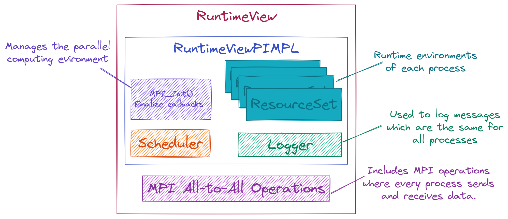

.. Copyright 2022 NWChemEx-Project
..
.. Licensed under the Apache License, Version 2.0 (the "License");
.. you may not use this file except in compliance with the License.
.. You may obtain a copy of the License at
..
.. http://www.apache.org/licenses/LICENSE-2.0
..
.. Unless required by applicable law or agreed to in writing, software
.. distributed under the License is distributed on an "AS IS" BASIS,
.. WITHOUT WARRANTIES OR CONDITIONS OF ANY KIND, either express or implied.
.. See the License for the specific language governing permissions and
.. limitations under the License.

.. _runtime_view_design:

###########################
Designing RuntimeView Class
###########################

The need for the ``RuntimeView`` class grew out of
:ref:`parallel_runtime_design`. Here we flesh the design out more.

*************************************
Why Do We Need the RuntimeView Class?
*************************************

As discussed in :ref:`parallel_runtime_design`, the ``RuntimeView`` class is
ParallelZone's abstraction for modeling the runtime environment. ``RuntimeView``
will also serve as the top-level :ref:`api` for accessing ParallelZone
functionality.

*****************************************
What Should the RuntimeView Class Manage?
*****************************************

ParallelZone assumes it is managing the runtime environment for a potentially
multi-process program. In general that program can be running on a laptop, the
number one supercomputer in the world, or anything in between.

1. ``RuntimeView`` is a view of the runtime environment at the highest level.
   System-wide state will be accessible from ``RuntimeView``. State includes:

   - System-wide scheduling
   - System-wide printing
   - Processes
   - Hardware

#. Multi-process operations need to go through ``RuntimeView``.
#. MPI compatability.
#. Flexibility of backend.

************************
RuntimeView Architecture
************************

.. _fig_runtime_view:

   Schematic illustration of the RuntimeView class and its major pieces.

The architecture of ``RuntimeView`` is shown in :numref:`fig_runtime_view`. This
addresses the above consideration by (numbering is from above):

1. Introducing components for each piece of state. Process to component affinity
   is maintained by ``ResourceSet`` objects.
#. Exposing MPI All-to-All operations at the ``RuntimeView`` level.

   - MPI All-to-One and One-to-All Operations are delegated to ``RAM`` and
     ``GPU`` objects in a particular ``ResourceSet``.
   - This facilitates selecting start/end points.

#. MADNESS is built on MPI. MPI is exposed through MADNESS.
#. The use of the PIMPL design allows us to hide many of the backend types. It
   also facilitates writing an implementation for a different backend down the
   line (although the API would need to change too).

Some finer points:

- The scheduler is envisioned as taking task graphs and scheduling them in a
  distributed and threaded manner. The latter relies on collaboration with
  ``ResourceSet`` instances.
- The Logger is an instance that every process can access. It represents the
  authoritative printing of the program. It's exact behavior should be
  customizable, but it is assumed this logger is always called in a SIMD manner
  by all processes. Default behavior is to redirect all output to ``/dev/null``
  except that of the root process.

*************
Proposed APIs
*************

Examples of all-to-all communications

.. code-block:: c++

   auto rt = get_runtime();

   auto data = generate_data();

   // This is an all gather
   auto output = rt.gather<RAM>(data);

   // This is an all reduce
   auto output2 = rt.reduce<RAM>(data, op);
